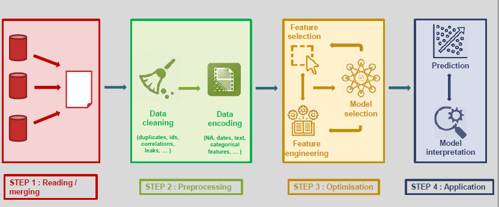

# Practical Concepts {#practical_concepts} 

## Gradient Descent

Gradient descent is an algorithm that aims to minimize a function by finding a local minimum closest to the initialization value. The goal is to find some value $A$ such that $F(A)$ is the smallest possible. 
Let $F(x)$ be a function differentiable at initial value $A$. Then for each iteration of gradient descent, one updates the value of $A$ by “stepping” in the opposite direction of the gradient function.

$$A_{n+1} = A_{n} - \alpha \nabla F(A_n)$$

$\alpha$ is called the learning rate.  This gradient descent step is repeated for a number of iterations, which can be predetermined in advance, or the learning could be halted after meeting a certain condition.

A helpful visualization: suppose the function $F$ is the altitude of a mountain range, and the value $A$ is the location of a marble. Thus we minimize $F$ by finding the location on the mountain range with the lowest altitude. Using gradient descent, we drop the marble somewhere based on our initial guess. Due to gravity, the marble will roll towards the lowest area in its proximity.

A potential pitfall is that this algorithm finds a local minimum, but not the global minimum. See below for an example with initialization at $A$: the value we end at using gradient descent would be $B$. This may be problematic, given that the true minimum is at $C$.

Useful Resources:

- [Linear Regression using Gradient Descent (September 2018, Towards Data Science)](https://towardsdatascience.com/linear-regression-using-gradient-descent-97a6c8700931)
- [Gradient Descent (Wikipedia)](https://en.wikipedia.org/wiki/Gradient_descent)

## Backpropagation

Useful Resources:

- [CS 231N: Understanding Backpropagation](http://cs231n.github.io/optimization-2/)

## Cross-Validation & Hyperparameter Tuning

A typical machine learning model relies on two categories of inputs, or "parameters": model parameters - the weights learned from the data - and learning parameters or hyperparameters - general configuration settings for the model. Determining the best hyperparameters for the task is a crucial part of machine learning.  

Model parameters are learned from the data. They typically reflect how heavily to weight input features in a prediction. For example, if an algorithm determines square footage to be twice as important as number of bathrooms in determining a house’s value, then the weight corresponding to square footage would be double that corresponding to number of bathrooms. When the model learns a line `y = Wx + b` in linear regression, `W` and `b` are model parameters. These parameters are learned from the data and are required to make predictions.  

However, training a model usually requires setting several other "hyperparameters"" that define how the model is structured and trained. These include the learning rate (how fast to replace old estimations with new ones), along with parameters necessary to configure different models, like the number of layers in a neural network, or the value of k in k-nearest-neighbors. The process of deciding which hyperparameters result in the best model performance is called “hyperparameter tuning.” This is a time-consuming but important process for most machine learning tasks. 

Learning hyperparameters requires a separate "validation set", distinct from the training and test sets. Using a separate dataset is crucial; using the test set to test hyperparameter performance would be poor practice. One of the sacred rules of machine learning is to never use the test data to set parameters. Training on the test set risks overfitting the model to the test set, causing it to fail to generalize to new data in the real world. Instead, all parameters should be estimated before the model ever sees the test set, so that it can be fairly evaluated on unseen data. 

This technique is called cross-validation. For example, you might set aside 20% of the training data as a validation set. After estimating model parameters from the training set, different hyperparameters can be tested on the validation set. An even more reliable way to evaluate the performance of a set of hyperparameters is to create k splits of the data. Iterate over the k splits; on each iteration, select that split to be the validation set and train on the rest of the splits combined. To evaluate the performance of a set of hyperparameters, average its performance over all k iterations. This is known as k-fold cross-validation. K-fold cross-validation is less susceptible to overfitting, but is more computationally expensive.

Useful Resources:

- [CS 231N: Validation Sets for Hyperparameter Tuning](http://cs231n.github.io/classification/#val)

## Transfer Learning

Useful Resources:

- [CS 231N: Transfer Learning](http://cs231n.github.io/transfer-learning/)

## Data Augmentation

## AutoML

Currently, a big limiting factor in scaling up the application of machine learning to various domains is the need for a team of specialists to support the end to end ML process. Everything from the ingestion of data, to data pre-processing, to feature engineering and model interpretation, requires individuals who deeply understand the various facets of the pipeline. 

Automated machine learning (autoML) seeks to abstract away much of the technical processes required for each of these stages. It helps to automate the end to end machine learning pipeline to enable more non-experts to develop and scale effective and robust predictive models.

There are some broad categories of autoML, namely, automated data preparation and ingestion, automated feature engineering and hyperparameter tuning as well as automated model selection. Different autoML providers target different stages of the pipeline. For instance, the open source packages auto-sklearn and ATM (auto-tune models) automate hyperparameter optimization and model selection, while TPOT creates entire end to end pipelines using genetic programming. 

**Limitations**

- While autoML is useful in abstracting away the nitty gritty details of ML implementation, it could potentially exacerbate model complexity. Without model interpretability, there might be a tendency to treat the autoML models as a black box. As a black box, model predictions might be difficult to understand and interpret. While open source autoML packages such as Featuretools has a built in module to explain predictions, many autoML packages still do not.
- Further, autoML typically works well in supervised learning scenarios where there is a clear measure of success. In unsupervised or reinforcement learning environments, there does not exist an objective function which automated models could optimize for easily.
- Finally, feature extraction and engineering is still best performed by specialists with embedded knowledge expertise. While autoML tools can infer generic feature types from similarly structured datasets, the best features still come from heuristics based on experience in the field.

**Current AutoML commercial providers**

- [Auger.ai](http://auger.ai)
- DataRobot
- Google AutoML
- Microsoft Azure AutoML
- OneClick.ai

**Current AutoML open source packages**

- Auto-sklearn
- Auto-Tune Models
- Caret
- H2O
- TPOT

**Resources**

- [Building AI to Build AI at NeurIPS (Kdnuggets, January 2019)](https://www.kdnuggets.com/2019/01/building-ai-to-build-ai-neurips-automl-challenge.html)
- [Why AutoML Won't Replace Data Scientists Yet (Kdnuggets, March 2019)](https://www.kdnuggets.com/2019/03/why-automl-wont-replace-data-scientists.html)
- [AutoML, the next wave of machine learning](https://heartbeat.fritz.ai/automl-the-next-wave-of-machine-learning-5494baac615f)