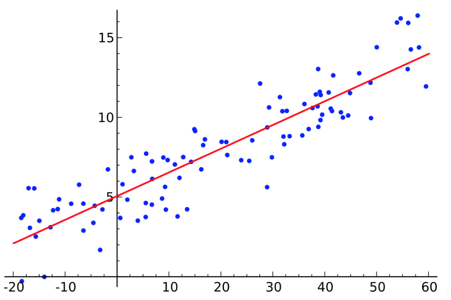
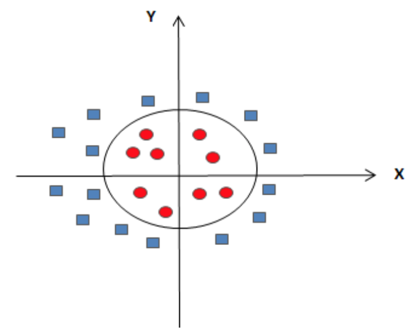
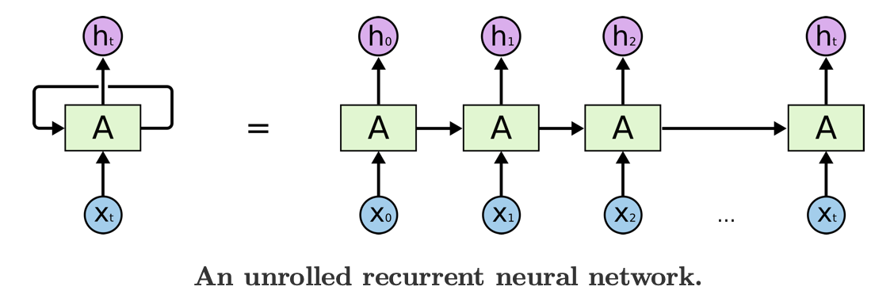
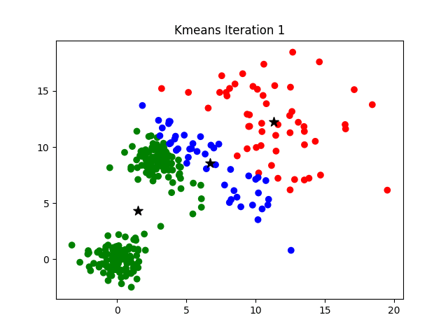
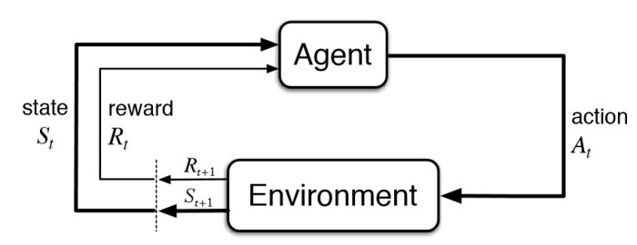

# Techniques {#techniques}

Machine learning can be broadly bucketed into three categories:

(1) Supervised Learning
(2) Unsupervised Learning
(3) Reinforcement Learning

Supervised learning encompasses tasks that try to predict a value or category for some input data using ground-truth labeled examples. Within supervised learning, there are typically two tasks we're interested in:

(1) Regression - predicting a continous value, such as housing price
(2) Classification

For example, a supervised learning model might predict stock price given past market data (regression), or determining whether a photograph contains a cat given labeled pictures of both cats and not-cats (classification). These labeled examples are called “training data.” In the cat example, the model determines which distinctive features most characterize “cat-ness” by examining the labeled examples, enabling it to classify new pictures as “cat” or “not-cat.”

Useful Resources:

- [Classification Versus Regression](https://medium.com/simple-ai/classification-versus-regression-intro-to-machine-learning-5-5566efd4cb83)

Unsupervised learning doesn’t get any training data to learn from. Instead of training a model on labeled data, the model discovers structure in unlabeled data. Examples of unsupervised learning include clustering news articles based on similar topics, or identifying outliers in machine behavior to predict faults.

Reinforcement learning trains an agent to accomplish a complex goal by identifying the next best step to take.  Examples include playing PacMan or chess.

In all of these categories, an engineer must specify an objective function, which is a measure of how well the model performs. The machine learning model then tries to minimize or maximize this objective function. For example, in the cat task, the engineer might define a loss function as the percentage of incorrectly classified images; the model would then try to minimize this loss. The engineer must specify how to incorporate feedback from a correct or incorrect decision back into the model so that it can adjust its parameters and improve performance on the objective function.

## Regression (Supervised)

### Linear Regression

Linear regression uses a line to approximate the relationship between an independent variable and a dependent variable. The learning task is to find the correct line, given many labeled training examples (points on the graph).

A rudimentary example is predicting a house’s price from its square footage (in practice, models use many more input features; for interpretability we simplify to a single input feature). To train the model, you would feed it training examples labeled with ground truth: e.g. house 1 has 1,500 square feet and sold for $200,000; and house 2 has 3,000 square feet and sold for $500,000. The model’s goal is to learn a pattern from these square footage-housing price pairs. Then in the future, when given only a square footage, it can predict the price accurately. 

The pattern linear regression models learn is a simple line (with more features, this line is multi-dimensional). After the model outputs a line, prediction is easy. To predict a price from any given square footage, find the square footage on the x-axis, move upward to see the y-value of the line at this point, and output this as the predicted price. The diagram below shows this process. Gray points are the training examples; the red line was found by the model to fit these training examples most closely.

More concretely, the model tries to find a line in the form `y = Wx + b` (where `W` is the slope and `b` is the y-intercept) to fit its training data most tightly. Several methods exist for finding this `W` and `b`. Least-squares is a popular method, but other options, like ridge regression, are also available.

Summary:

- Inputs:
    - Labeled training examples
    - Unlabeled test examples for which a label must be predicted
- Outputs:
    - Labels for all of the previously unlabeled vectors
- Potential pitfalls:
    - Overfitting the dataset (high variance). Finding a line that is too specific to the training examples and doesn’t generalize well to the new examples. 
    - Not flexible enough for more complex datasets (high bias). Maybe the relationship between square footage and housing price isn’t linear! In that case, linear regression would not be the best choice; k-nearest-neighbors or some other approach that allows more complex decision boundaries would be better-suited.

Useful Resources:

## Time-Series (Supervised)

### ARIMA

Summary:

- Inputs:
- Outputs:
- Potential pitfalls:

Useful Resources:

- [Introduction to Forecasting with ARIMA in R](https://www.datascience.com/blog/introduction-to-forecasting-with-arima-in-r-learn-data-science-tutorials)
- [Step By Step Graphic Guide to Forecasting Through ARIMA Modeling In R](http://ucanalytics.com/blogs/step-by-step-graphic-guide-to-forecasting-through-arima-modeling-in-r-manufacturing-case-study-example/)
- [ARIMA Models - Manufacturing Case Study Example](http://ucanalytics.com/blogs/arima-models-manufacturing-case-study-example-part-3/)
- 
- [Time Series Seasonal ARIMA Model In Python](http://www.seanabu.com/2016/03/22/time-series-seasonal-ARIMA-model-in-python/)

### Prophet

Summary:

- Inputs:
- Outputs:
- Potential pitfalls:

Useful Resources:

- [Prophet Quickstart](https://facebook.github.io/prophet/docs/quick_start.html#python-api)

## Classification (Supervised)

### k-Nearest Neighbors (k-NN)

K-nearest neighbors (k-NN) is a simple algorithm that can be used for both classification and regression. The crucial idea in k-NN is that, given an input with an unknown label, the model looks at the known examples that are most similar to the previously-unseen example, calculated through some distance metric. It then uses the labels of these k nearest neighbors to output a prediction for the new example. k is a positive integer, and is typically small.

- Classification: The output value is the class determined by a plurality vote of the input object's neighbors.
    - In the tumor example, where we are trying to determine whether a tumor is benign or malignant, the model finds the k tumors that look most similar to this one, and output the label held by a plurality of neighbors.
- Regression: The output value is the average of the values of k nearest neighbors.
    - In the housing price example, we find the k nearest neighbors - probably the k houses that have the closest square footage, and output the average of their prices.

If `k = 1`, then the input object is simply assigned to the class or value of its single nearest neighbor.

Summary:

- Inputs:
    - A data set of labeled vectors (with possibly multiple features) for training.
    - A set of unlabeled vectors that need to be classified.
- Outputs:
    - Labels for each of the unlabeled vectors.
- Potential pitfalls:
    - Applying the correct distance metric
        - For continuous variables, Euclidean distance is typically used, though there exist other continuous distance metrics.
        - For discrete variables (i.e. classification), the distance metric depends on the application.  For instance, classification based on bag-of-words might use the overlap coefficient or Hamming distance.
    - Skewed classes
        - The basic "majority voting" classification can perform poorly when the class distribution is skewed. Examples from the more frequent class will show up more often and overwhelm the less frequent class, biasing the prediction of the new example.  One way to overcome this problem is to weight the classification, taking into account the distance from the test point to each of its k nearest neighbors. The class (or value, in regression problems) of each of the k nearest points is multiplied by a weight proportional to the inverse of the distance from that point to the test point.
    - Choosing the right k
        - The best choice of k depends upon the data; generally, larger values of k reduces effect of the noise on the classification, but make boundaries between classes less distinct.
        - A good k can be selected via hyperparameter optimization.
    - Curse of dimensionality
        - For high-dimensional data (i.e., with number of dimensions more than 10), some metrics such as the Euclidean distance will be ineffective because all data points are almost equidistant to the input example datapoint.  In this case, selecting relevant neighbors becomes difficult.  To resolve this, dimension reduction is usually performed prior to applying the k-NN algorithm.
    - Breaking ties
        - In binary (two class) classification problems, it is helpful to choose k to be an odd number as this avoids tied votes.

Useful Resources:

- [k-nearest neighbors algorithm (Wikipedia)](https://en.wikipedia.org/wiki/K-nearest_neighbors_algorithm)

### Logistic Regression

Logistic regression is similar to linear regression in assuming a linear relationship between the dependent and independent variables. However, its name is misleading because unlike linear regression, it is used for classification.

The model outputs a probability that a training example belongs to each category. For example, it will calculate the probability that a tumor is benign or malignant. To compute this probability, logistic regression first computes the same linear function `Wx + b` on the input `x`, then feeds the result into a sigmoid function, which maps to outputs between 0 and 1, inclusive. This final output can then be interpreted as a probability. (Logistic regression can also be generalized to consider more than two categories. See sidenote.)

The last step is to decide on the cutoff, or “decision boundary,” to classify the example. For example, we might say that if the probability of an tumor being malignant is greater than 0.7, it should be classified as malignant. This parameter can be tuned and can also be a function rather than a numerical threshold.

Sidenote: Logistic regression can also be generalized to consider more than two categories. One way of doing this is to first train a 2-category model of Category A vs Non-Category A, then another model for Category B vs Not Category A or B, then another model for Category C vs Not A or B or C, and so on. To classify a vector, run through the models in sequence.

Summary:

- Inputs:
    - A set of labeled vectors each belonging to a discrete category for training.
    - A set of unlabeled vectors that need to be classified.
- Outputs:
    - Classifications for each of the unlabeled vectors.
- Potential pitfalls:
    - If the training data is linearly separable (there is a line that can be drawn to completely separate the two categories), then the training data needs to be regularized. Otherwise, the weights of the model go to infinity.

Useful Resources:

### Naive Bayes

Naive Bayes is a classification technique that relies on Bayes’ Theorem. Bayes’ Theorem is a fundamental statistical theorem that calculates the probability of an event happening based on existing evidence of conditions related to an event.

$$P(A|B) = \frac{P(B|A)P(A)}{P(B)}$$

Bayes' Theorem essentially means that the probability of seeing event `A` if you've already seen related event `B` is equivalent to the probability of seeing event `B` if you've already seen related event `A`.

$$P(A|B)P(B) = P(B|A)P(A)$$

Assuming that the features in a vector are independent, we can use Bayes' Theorem to create a naive Bayes model such that

$$P(y|x_1, x_2, … x_n) = P(y) \times P(x_1|y) \times P(x_2|y) \times ... \times P(x_n|y) = P(y) \prod_{i=1}^{n}P(x_n|y)$$

where $y$ is the class of the vector, and $x_1$ to $x_n$ are features of the vector. 

Typically, because $P(x_n|y)$ is not known ahead of time, a training set of vectors is used for parameter estimations. Once the prior probability of all classes $y$ and $P(x_n|y)$ for each feature and class pair are known, then unknown test data is categorized into the most likely category.

An example of a task for Naive Bayes could be digit recognition based on handwriting in a 9-grid square. The features would then be whether each of the 9 pixels are on or off, and the categories would be the 10 possible digits. One could train the model using a set of known, labeled written digits, then predict future written digits.

Summary:

- Inputs:
    - $P(y)$, $P(x_n|y)$ for each feature $x_n$ and category $y$. If not known, estimate these values using labeled training vectors.
    - A set of unlabeled test vectors.
- Outputs:
    - Categories for each of the unlabeled test vectors.
- Potential pitfalls:
    - Naive Bayes assumes independence between each of the vectors in the feature. Independence is hard to prove in the real world, and it’s difficult to have a set of features that are all independent.
    - To make the model more generalizable, smoothing is often applied, and domain expertise is used in generating $P(x_n|y)$, also called parameter estimation.

Useful Resources:

- [Berkeley CS188 Slides on Bayes Theorem](https://inst.eecs.berkeley.edu/~cs188/sp12/slides/cs188%20lecture%2020%20--%20naive%20bayes%202PP.pdf)

### Support Vector Machines (SVM)

Support Vector Machines are used for classification: they try to find a line that separates data in one category from data in another category. However, they provide two big improvements on logistic regression. First, they can fit nonlinear decision boundaries. For example, imagine your data looks like this:

Clearly a diagonal line is not going to fit this data well; it would cut through the middle of both categories. SVM allows the classifier to learn a nonlinear decision boundary by using the “kernel trick,” which maps the data to a higher-dimensional space, then linearly separates the data in this higher-dimensional space. This translates to more complex decision boundaries in the lower-level space.

SVMs can also improve classification by explicitly trying to maximize the space between the two categories. This space is called the “margin.” In the diagram below, the model found a line C that best maximized the distance between the two categories.

Summary:

- Inputs:
- Outputs:
- Potential pitfalls:

Useful Resources:

### Decision Trees

Summary:

- Inputs:
- Outputs:
- Potential pitfalls:

Useful Resources:

- [Decision Trees - An Intuitive Introduction](https://medium.com/x8-the-ai-community/decision-trees-an-intuitive-introduction-86c2b39c1a6c)
- [How to Visualize a Decision Tree from a Random Forest in Python using Scikit-Learn](https://towardsdatascience.com/how-to-visualize-a-decision-tree-from-a-random-forest-in-python-using-scikit-learn-38ad2d75f21c)

### Random Forests

Summary:

- Inputs:
- Outputs:
- Potential pitfalls:

Useful Resources:

- [Machine Learning Crash Course: Part 5 - Decision Trees and Ensemble Models](https://ml.berkeley.edu/blog/2017/12/26/tutorial-5/)

## Neural Networks (Supervised)

### Convolutional Neural Networks (CNN)

Summary:

- Inputs:
- Outputs:
- Potential pitfalls:

Useful Resources:

- [Intro to Convolutional Neural Networks](http://cs231n.github.io/convolutional-networks/)
- [Visualizing what ConvNets Learn](http://cs231n.github.io/understanding-cnn/)

### Recurrent Neural Networks (RNN)

When we process sequence data, like reading a paragraph or listening to music, we often rely on the context of what we've processed before to make decisions about the future.  A basic neural network doesn't accomplish this - it can only make decisions based on the current input.  Fortunately, recurrent neural networks (RNNs) come to the rescue!

An RNN is a neural network that generates not only an output, but also a "hidden state" that feeds back into itself.  While this may seem complex, we can unroll this network in time to see how the hidden state feeds into the next timestep along with the next timestep's inputs.  This hidden state represents the context of previous inputs, so we aren't throwing away previous learnings!

In each timestep, we therefore incorporate the previous timestep's context (or nothing at the start), along with the current input, to generate an output (i.e. the next word in a sentence translation).

Summary:

- Inputs:
- Outputs:
- Potential pitfalls:

Useful Resources:

- [Illustrated Guide to Recurrent Neural Networks (September 2018, Towards Data Science)](https://towardsdatascience.com/illustrated-guide-to-recurrent-neural-networks-79e5eb8049c9)
- [The Unreasonable Effectiveness of Recurrent Neural Networks (May 2015, Andrej Karpathy)](http://karpathy.github.io/2015/05/21/rnn-effectiveness/)

### Long Short Term Memory (LSTM)

One challenge with RNNs is that they have trouble retaining long-term information.  For instance, consider what Christopher Olah (colah) has to say:

"If we are trying to predict the last word in 'the clouds are in the sky,' we don’t need any further context – it’s pretty obvious the next word is going to be sky. In such cases, where the gap between the relevant information and the place that it’s needed is small, RNNs can learn to use the past information."

On the other hand, "consider trying to predict the last word in the text 'I grew up in France… I speak fluent French.' Recent information suggests that the next word is probably the name of a language, but if we want to narrow down which language, we need the context of France, from further back. It’s entirely possible for the gap between the relevant information and the point where it is needed to become very large."

Due to a phenomenon known as the vanishing gradient problem (see Advanced Concepts section), an RNN's capability to learn from information from many timesteps ago quickly diminishes.  Fortunately, we have Long Short Term Memory networks (LSTMs) to the rescue!

Here's the basic concept of an LSTM:

- Prior information is recorded in a cell state that is passed along at each timestep
- At each timestep, based on the previous output and the current input, the network contains three gates that control whether or not information can pass through:
    - "Forget gate": How much of the previous cell state to forget (between 0 and 1)
    - "Input gate": How much of the current information to incorporate into the new cell state
    - "Output gate": What to output from the new cell state

The practical effect of these gates is that we can now ignore "useless" new information and keep its noise from overwhelming the actual signal from many timesteps ago.  LSTMs and its variants, such as the Gated Recurrent Unit (GRU) have proven themselves to be far superior to RNNs.

Summary:

- Inputs:
- Outputs:
- Potential pitfalls:

Useful Resources:

- [Understanding LSTM Networks](http://colah.github.io/posts/2015-08-Understanding-LSTMs/)
- [Illustrated Guide to LSTM’s and GRU’s: A step by step explanation (September 2018, Towards Data Science)](https://towardsdatascience.com/illustrated-guide-to-lstms-and-gru-s-a-step-by-step-explanation-44e9eb85bf21)

## Clustering (Unsupervised)

### K-Means

K-means clustering is one of the most common ways to identify groups in your data.  You start with unlabeled data (i.e. online customer sales data) and want to identify what clusters they can be bucketed into (i.e. customer archetypes).

How does it work?  You define an objective function to minimize, initialize the number and location of cluster centroids (randomly or through a heuristic), and keep repeating the following steps until some criteria is met (i.e. 1000 iterations or objective function is sufficiently small):

1. Update the cluster assignments of each data point
    - Each data point is assigned to the cluster centroid that is closest
2. Update the cluster centroids
    - Each cluster center is the average of the data points assigned to it

Note that k-means clustering usually requires some manual investigation.  The best way to start is to visualize your data and see if you can roughly identify groups.  If you see three groups, then start by initializing three cluster centroids.  If you can’t identify any groupings visually, then it’s a pretty good bet that whatever clustering the algorithm assigns isn’t going to be useful or interpretable.

Summary:

- Inputs:
- Outputs:
- Potential pitfalls:

Useful Resources:

- [K-Means Clustering: From A to Z (September 2018, Towards Data Science)](https://towardsdatascience.com/k-means-clustering-from-a-to-z-f6242a314e9a)

### Gaussian Mixture Model

Summary:

- Inputs:
- Outputs:
- Potential pitfalls:

Useful Resources:

## Dimensionality Reduction (Unsupervised)

### PCA

PCA, short for Principal Components Analysis, is a dimensionality reduction technique. All dimensionality reduction techniques seek to transform a large dataset containing many features to a smaller dataset with fewer features while preserving as much information as possible. 

One analogy is RAW image files versus lossy image files (e.g. JPEG / PNG). The RAW image files contain a lot of information, but requires significant storage space. JPEG images, on the other hand, are much smaller files with little perceptible loss in image quality. 

The motivation behind PCA includes visualizing the relationships between a large number of features, removing linear correlations between features and understanding the internal and underlying structure of a dataset. 

The intuition behind the PCA technique is to find the different orthogonal features which best explains the variance in the data. For each PCA, the input will be the set of original features and the output will be a set of reconstituted features (the principal components). 

Take an individual stock in the stock market for instance. Each stock is described by various features, such as the daily volume traded, its daily returns, the moving averages, the profit margins of the company and so on. As expected, these features are often correlated with each other. When we compare different stocks, there is a whole universe of different features which we could use to compare them. Yet, we know that many of these features are related. PCA helps us to prune the number of features. It constructs new linearly uncorrelated features (from the existing pool of features) which we can use to compare different stocks.

What then are these *principal components*? Principal components are orthogonal (linearly uncorrelated) features. The engine under the hood is simply solving for and ranking the eigenvectors with the highest eigenvalues in the dataset. Each principal component will provide a new angle from which to understand the data. This is because the relationships between the values in the dataset will be re-organized based on the new dimensions produced by PCA. 

Since each principal component is composed of a weighting of the original feature set, we can understand which of the original features are linearly correlated to each other. We can also understand which of the original features contribute to the maximal variance in the dataset. For instance, if one feature is strongly represented in the first principal component, we can argue that that particular feature has more explanatory power about the variance in the dataset than the other features.

**Limitations of PCA**

- Sensitivity to the scaling of the variables. For instance, if we use centimeters instead of meters for a feature, that feature will be weighted as contributing more to the principal components than before.
- Limited to linear correlations. PCA is only able to capture linear correlations between features. If there are non-linear correlations between the original features, the reconstituted principal components will not remove these correlations.

**Resources for PCA**

- [A step by step explanation of Principal Component Analysis, February 2019](https://towardsdatascience.com/a-step-by-step-explanation-of-principal-component-analysis-b836fb9c97e2)
- [Making sense of Principal Component Analysis](https://stats.stackexchange.com/questions/2691/making-sense-of-principal-component-analysis-eigenvectors-eigenvalues)
- [A tutorial on Principal Components Analysis, University of Otago](https://ourarchive.otago.ac.nz/bitstream/handle/10523/7534/OUCS-2002-12.pdf?sequence=1&isAllowed=y)
- [Visualising high-dimensional datasets using PCA and t-SNE in Python (October 2016, Medium)](https://medium.com/@luckylwk/visualising-high-dimensional-datasets-using-pca-and-t-sne-in-python-8ef87e7915b)

### t-SNE

Summary:

- Inputs:
- Outputs:
- Potential pitfalls:

Useful Resources:

- [Visualising high-dimensional datasets using PCA and t-SNE in Python (October 2016, Medium)](https://medium.com/@luckylwk/visualising-high-dimensional-datasets-using-pca-and-t-sne-in-python-8ef87e7915b)

## Neural Networks (Unsupervised)

### Autoencoders

Autoencoders are neural networks that try to learn a latent representation of some input, which is a fancy way of saying it figures out the important features that capture the essence of the input.  The purpose of building an autoencoder is typically:

- Dimensionality reduction or encoding data
    - Example: “Visualizing high-dimensional data is challenging. t-SNE is the most commonly used method but struggles with large number of dimensions (typically above 32). So autoencoders are used as a preprocessing step to reduce the dimensionality, and this compressed representation is used by t-SNE to visualize the data in 2D space.” ^[https://towardsdatascience.com/applied-deep-learning-part-3-autoencoders-1c083af4d798]
- Denoise data
    - Example: You have a grainy image but the random pixel values that cause the “graininess” is not useful for classifying what the image is.  You can adjust how you use the autoencoder by feeding it the grainy image and having it try to predict the clean image.

Autoencoders are comprised of two parts - an encoder neural network and a decoder neural network - and the inputs and outputs are the same.  When the input is fed through the encoder, it is forced into a smaller, “lossy” representation due to the smaller number of neurons at the end of the encoder network.  This compressed representation is then fed through the decoder, which tries to reconstruct the input.  During the training process, the autoencoder therefore learns to approximate an identity function, and is forced to extract the most relevant features of the input.

For the more technical folks, the function of an autoencoder is similar to principal component analysis (PCA).

Summary:

- Inputs:
- Outputs:
- Potential pitfalls:

Useful Resources:

- [How Autoencoders Work - Understanding the Math and Implementation (Kaggle)](https://www.kaggle.com/shivamb/how-autoencoders-work-intro-and-usecases)
- [Deep inside: Autoencoders (February 2018, Towards Data Science)](https://towardsdatascience.com/deep-inside-autoencoders-7e41f319999f)
- [Autoencoders - Deep Learning Bits #1 (February 2017, Hacker Noon)](https://hackernoon.com/autoencoders-deep-learning-bits-1-11731e200694)
- [Applied Deep Learning - Part 3: Autoencoders (October 2017, Towards Data Science)](https://towardsdatascience.com/applied-deep-learning-part-3-autoencoders-1c083af4d798)

### Generative Adversarial Networks

Generative adversarial networks (GANs) exploit competition between two neural networks - a generator network and a discriminator network - in order to create data that mimics training examples. While the discriminator network is trained to recognize a particular class of data, such as genuine da Vinci paintings, the generator uses classification feedback from the discriminator to progressively output samples that make the discriminator increasingly ambivalent, or unable to tell between genuine sample data and the generator network’s output. 

GANs were first showcased by OpenAI researcher Ian Goodfellow in the 2014 paper [Generative Adversarial Networks](https://arxiv.org/abs/1406.2661); for those familiar with gradient descent, Goodfellow’s 2014 paper proposed a two-step variation on stochastic gradient descent for training GANs. First, the discriminator network is optimized using a series of batched training examples. Then, the generator is sampled for its current output and optimized based on the output of the discriminator on those samples.

As a properly trained GAN is able to generate data that appears similar to training data, GANs have received significant media attention for their ability to stylistically mimic artwork or video. In October 2018, Christie’s [sold a portrait](https://www.theverge.com/2018/10/23/18013190/ai-art-portrait-auction-christies-belamy-obvious-robbie-barrat-gans) created by a GAN; other GANs have been applied to [generating human faces](https://www.telegraph.co.uk/technology/2018/12/18/ai-can-now-create-100-per-cent-lifelike-human-faces-scratch/) and [creating music](https://salu133445.github.io/musegan/).

Summary:

- Inputs:
- Outputs:
- Potential pitfalls:

Useful Resources:

## Reinforcement Learning

Reinforcement learning (RL) is a "type of machine learning technique that enables an agent to learn in an interactive environment by trial and error using feedback from its own actions and experiences" (KDNuggets). 

The most intuitive way to understand RL is to think about a child and how they learn to adapt to the world around them. When a child is a toddler and still unable to talk, they take actions in the world which provide a stream of feedback signals to them. Each feedback signal provides the child with some information about the world around them as well as an indication of whether they should continue to taking that action or not. For example, if the toddler is hungry, they will cry (action) and they will get some food (feedback signal). If the toddler touches hot stove (action), they will scald themselves (feedback signal) and learn eventually not to do that. As they interact more with the environment around them, their behavior will be *reinforced* or *punished*. This is the basis of the reinforcement learning model.

RL differs from the above supervised and unsupervised methods of machine learning. Unlike supervised learning, RL does not have a static training set of correct examples to learn from. Instead, RL agents receive signals from the environment which reward and punish negative behavior. Unlike fixed supervised learning training sets, the RL environment is often stochastic and non-deterministic in nature, much like the real world. 

Unlike unsupervised learning, RL does not seek to find similarities or differences or other patterns in the data. Instead, RL agents respond to the reward signals given from the environment and seek to maximize their total cumulative reward by the end of each episode.

The basic RL model is as follows:

In a simplified RL world, the *input* will contain an agent and an environment. The environment is the world in which the RL agent operates in. At each time point, the environment will provide a particular *state* to the agent. This state describes the world in which the agent is in at that particular time point. The agent will then use a *policy* to decide which *action* to take in the environment. These actions will elicit a *reward* from the environment. This reward will then allow the agent to update its policy to modify the future actions that it will take.

For instance, in the gif above, Mario is receiving both direct reward (from its current action) as well as the estimated future reward, calculated using the current policy that it is following. If Mario touches an enemy, he'll die. This will update the direct reward, as well as the policy for future runs.

Historically, the field of RL developed out of the nexus of control theory, optimization and machine learning. As a result, many of its applications have been in the field of robotics (such as autonomous flight control). The current focus of RL research, however, has been focused on games such as classical board games like Chess and Go, as well as computer games from the simple such as Sonic the Hedgehog to more complex ones such as StarCraft 2 and DOTA 2. 

The main reason behind using games to build and develop RL algorithms is due to two main factors: 

1. Being able to generate unlimited amounts of experience. Spinning up instances of new games is relatively trivial and can be parallelized on multiple machines. In many real life problems, it is difficult to construct an artificial world.

2. Being able to shape a dense and well-defined reward function. In many games, creating a well-defined reward function is relatively easier to do. For instance, in Atari games, the speed at which a level is finished, coupled with not dying during the game, is a well-defined reward function. Further, games provide dense reward functions as the action-reward delay in an environment is small and consequently, providing a tight feedback loop. In many real-life scenarios, it is difficult to create a reward function which is both dense and well-defined. A sub-optimal reward function will lead to the RL agent optimizing for the wrong objective.

No doubt, RL has been instrumental in breakthroughs in playing [classical](https://deepmind.com/research/alphago/) [games](https://deepmind.com/blog/alphazero-shedding-new-light-grand-games-chess-shogi-and-go/), more complex [computer](https://deepmind.com/blog/alphastar-mastering-real-time-strategy-game-starcraft-ii/) [games](https://openai.com/five/), optimizing [data center efficiency](https://deepmind.com/applied/deepmind-google/) and [protein folding](https://deepmind.com/blog/alphafold/), generalizing RL to other use-cases remains a non-trivial problem. Sample inefficiency, definition of reward functions and difficulty of consistent reproduction all currently plague RL solutions. 

In sum, as Google Brain Engineer Alex Irpan puts it: "Whenever someone asks me if reinforcement learning can solve their problem, I tell them it can’t. I think this is right at least 70% of the time." While there has been great interest in the RL paradigm, the real world use cases are currently limited and often require very specialized domain knowledge to accurately construct the environment and shape the rewards. As a result, it is often easier to apply and optimize shallow models (such as the ones elaborated on above) initially.

**Useful Resources**

- [Deep Reinforcement Learning Doesn't Work Yet](https://www.alexirpan.com/2018/02/14/rl-hard.html)
- [Spinning Up: OpenAI DeepRL Introduction](https://spinningup.openai.com/en/latest/)
- [Skymind's Deep RL Wiki](https://skymind.ai/wiki/deep-reinforcement-learning)
- [5 Things You Need to Know about Reinforcement Learning](https://www.kdnuggets.com/2018/03/5-things-reinforcement-learning.html)
